# NeuroChronoGraph: Model Architecture Documentation

## Overview

NeuroChronoGraph is a graph neural network designed for EEG-based differential diagnosis of Alzheimer's Disease (AD) and Frontotemporal Dementia (FTD). The architecture incorporates neurophysiologically-motivated design principles that provide useful inductive biases for interpretability.

--- 

## Pipeline Overview

```
┌─────────────────────────────────────────────────────────────────────────────┐
│                        NeuroChronoGraph Pipeline                            │
├─────────────────────────────────────────────────────────────────────────────┤
│                                                                              │
│  ┌──────────┐    ┌──────────────┐    ┌──────────────┐    ┌──────────────┐  │
│  │   EEG    │───►│ Preprocessing │───►│   Feature    │───►│    Graph     │  │
│  │  Input   │    │   Pipeline    │    │  Extraction  │    │ Construction │  │
│  └──────────┘    └──────────────┘    └──────────────┘    └──────────────┘  │
│       │               │                    │                    │           │
│       ▼               ▼                    ▼                    ▼           │
│  19 channels     Bandpass filter     Spectral features    Node features    │
│  500 Hz          Re-referencing      Connectivity          Edge weights    │
│  12 min          Artifact reject     Complexity            Adjacency       │
│                  4s epochs           Graph metrics                          │
│                                                                              │
│  ┌──────────────────────────────────────────────────────────────────────┐  │
│  │                      NeuroChronoGraph Model                           │  │
│  │  ┌────────────┐  ┌────────────┐  ┌────────────┐  ┌────────────────┐  │  │
│  │  │  Adaptive  │  │Cross-Band  │  │  Modular   │  │   Clinical     │  │  │
│  │  │   Graph    │─►│  Attention │─►│   Brain    │─►│  Conditioning  │  │  │
│  │  │  Learning  │  │            │  │ Transformer│  │     (FiLM)     │  │  │
│  │  └────────────┘  └────────────┘  └────────────┘  └────────────────┘  │  │
│  └──────────────────────────────────────────────────────────────────────┘  │
│                                      │                                      │
│                                      ▼                                      │
│  ┌──────────────────────────────────────────────────────────────────────┐  │
│  │                     Hierarchical Output Heads                         │  │
│  │  ┌──────────────┐    ┌──────────────┐    ┌──────────────────────┐   │  │
│  │  │  Screening   │    │   Staging    │    │      Subtyping       │   │  │
│  │  │ CN vs Impair │    │  MCI vs Dem  │    │      AD vs FTD       │   │  │
│  │  └──────────────┘    └──────────────┘    └──────────────────────┘   │  │
│  └──────────────────────────────────────────────────────────────────────┘  │
└─────────────────────────────────────────────────────────────────────────────┘
```

---

## Model Architecture Components

### Stage 1: Adaptive Graph Learning

**Purpose:** Learn the optimal brain connectivity structure from data, combining prior knowledge with data-driven discovery.

```
                    ┌─────────────────────────────────────┐
                    │      Adaptive Graph Learning        │
                    ├─────────────────────────────────────┤
                    │                                     │
       ┌────────────┼───────────┐     ┌──────────────────┤
       │            │           │     │                  │
       ▼            ▼           ▼     │                  │
  ┌─────────┐  ┌─────────┐  ┌───────┐ │   ┌────────────┐│
  │  wPLI   │  │   PSD   │  │Channel│ │   │  Learned   ││
  │ Matrix  │  │Features │  │ Pos.  │ │   │  Adjacency ││
  └────┬────┘  └────┬────┘  └───┬───┘ │   └──────┬─────┘│
       │            │           │     │          │      │
       ▼            └─────┬─────┘     │          │      │
  ┌─────────┐             ▼           │          │      │
  │  Prior  │        ┌─────────┐      │          │      │
  │Adjacency│        │   Q,K   │      │          │      │
  │   A_p   │        │Attention│──────┘          │      │
  └────┬────┘        └─────────┘                 │      │
       │                                         │      │
       └──────────────┬──────────────────────────┘      │
                      ▼                                 │
               ┌────────────┐                           │
               │  A_final   │                           │
               │ = αA_p +   │◄──────────────────────────┘
               │(1-α)A_learn│    α = learnable parameter
               └────────────┘
                      │
                      ▼
               Multi-Scale: A + A² + A³
              (1-hop) (2-hop) (3-hop)
```

**Parameters:**
- Hidden dimension: 64
- Attention heads: 4
- GNN layers: 2
- α (learned): ~0.6 (balances prior and learned connectivity)
- Dropout: 0.6

---

### Stage 2: Cross-Band Attention

**Purpose:** Model frequency-domain interactions that are critical for understanding brain communication patterns.

```
       ┌───────────────────────────────────────────────────────┐
       │                 Cross-Band Attention                   │
       ├───────────────────────────────────────────────────────┤
       │                                                        │
       │   FREQUENCY BANDS                                      │
       │   ┌─────┐ ┌─────┐ ┌─────┐ ┌─────┐ ┌─────┐            │
       │   │Delta│ │Theta│ │Alpha│ │Beta │ │Gamma│            │
       │   │0.5-4│ │ 4-8 │ │8-13 │ │13-30│ │30-45│            │
       │   └──┬──┘ └──┬──┘ └──┬──┘ └──┬──┘ └──┬──┘            │
       │      │       │       │       │       │                │
       │      └───────┴───────┼───────┴───────┘                │
       │                      ▼                                 │
       │            ┌──────────────────┐                        │
       │            │  Cross-Attention │                        │
       │            │     Matrix       │                        │
       │            └────────┬─────────┘                        │
       │                     │                                  │
       │      ┌──────────────┼──────────────┐                  │
       │      ▼              ▼              ▼                  │
       │   θ-γ PAC      α-β Coupling    δ-θ Sync              │
       │  (Memory)     (Executive)    (Pathology)              │
       │   ↓ in AD      Alt in FTD     ↑ in both               │
       │                                                        │
       └───────────────────────────────────────────────────────┘
```

**Clinical Relevance:**
- **Theta-Gamma (θ-γ) PAC:** Reduced in AD → Memory encoding deficit
- **Alpha-Beta (α-β) Coupling:** Altered in FTD → Executive dysfunction
- **Delta-Theta (δ-θ) Synchrony:** Elevated in both → Pathological slowing

---

### Stage 3: Modular Brain Transformer

**Purpose:** Organize EEG channels according to brain anatomy, enabling biologically meaningful attention patterns.

```
       ┌───────────────────────────────────────────────────────┐
       │              Modular Brain Transformer                 │
       ├───────────────────────────────────────────────────────┤
       │                                                        │
       │     FRONTAL          TEMPORAL         PARIETAL        │
       │   ┌─────────┐      ┌─────────┐      ┌─────────┐       │
       │   │Fp1 Fp2  │      │ T3  T4  │      │ P3  Pz  │       │
       │   │ F3  F4  │      │ T5  T6  │      │    P4   │       │
       │   │ F7 Fz F8│      │         │      │         │       │
       │   └────┬────┘      └────┬────┘      └────┬────┘       │
       │        │                │                │             │
       │        ▼                ▼                ▼             │
       │   ┌─────────┐      ┌─────────┐      ┌─────────┐       │
       │   │  Intra- │      │  Intra- │      │  Intra- │       │
       │   │ Module  │      │ Module  │      │ Module  │       │
       │   │Attention│      │Attention│      │Attention│       │
       │   └────┬────┘      └────┬────┘      └────┬────┘       │
       │        │                │                │             │
       │        └────────────────┼────────────────┘             │
       │                         ▼                              │
       │                ┌─────────────────┐                     │
       │                │   Inter-Module  │                     │
       │                │   Cross-Attn    │                     │
       │                └────────┬────────┘                     │
       │                         │                              │
       │         ┌───────────────┼───────────────┐              │
       │         ▼               ▼               ▼              │
       │  Fronto-Parietal  Temporo-Parietal  Fronto-Temporal   │
       │   (Executive)      (Memory)        (Social Cog)       │
       │   FTD pathway      AD pathway      FTD pathway         │
       │                                                        │
       │                    OCCIPITAL                           │
       │                  ┌─────────┐                           │
       │                  │ O1  O2  │                           │
       │                  └─────────┘                           │
       │                  (Alpha Gen)                           │
       │                                                        │
       └───────────────────────────────────────────────────────┘
```

**Module Assignment:**
| Module | Channels | Function | Disease Relevance |
|--------|----------|----------|-------------------|
| Frontal | Fp1, Fp2, F3, F4, F7, F8, Fz | Executive control | FTD: Primary pathology |
| Temporal | T3, T4, T5, T6 | Memory, language | FTD: Secondary involvement |
| Parietal | P3, Pz, P4 | Attention, spatial | AD: Early hypometabolism |
| Occipital | O1, O2 | Visual, alpha | AD: Alpha disruption |

---

### Stage 4: Clinical Conditioning (Hierarchical FiLM)

**Purpose:** Integrate patient clinical information at different processing stages, mimicking the brain's context-dependent processing.

```
       ┌───────────────────────────────────────────────────────┐
       │            Hierarchical Clinical Conditioning          │
       ├───────────────────────────────────────────────────────┤
       │                                                        │
       │   CLINICAL DATA                                        │
       │   ┌──────┐  ┌──────┐  ┌──────┐                        │
       │   │ Age  │  │ MMSE │  │ Sex  │                        │
       │   └──┬───┘  └──┬───┘  └──┬───┘                        │
       │      │         │         │                             │
       │      ▼         ▼         ▼                             │
       │   ┌──────────────────────────────────────────┐        │
       │   │            FiLM Conditioning              │        │
       │   │                                           │        │
       │   │  Layer 1-3: Age modulation               │        │
       │   │     F_out = γ_age · F_in + β_age         │        │
       │   │                                           │        │
       │   │  Layer 4-6: MMSE modulation              │        │
       │   │     F_out = γ_mmse · F_in + β_mmse       │        │
       │   │                                           │        │
       │   │  Layer 7-9: Combined modulation          │        │
       │   │     F_out = γ_combined · F_in + β        │        │
       │   │                                           │        │
       │   └──────────────────────────────────────────┘        │
       │                         │                              │
       │                         ▼                              │
       │              ┌──────────────────┐                      │
       │              │    Uncertainty   │                      │
       │              │    Estimation    │                      │
       │              └──────────────────┘                      │
       │                                                        │
       └───────────────────────────────────────────────────────┘
```

**Rationale:**
- **Early layers (Age):** Brain aging affects baseline network properties
- **Middle layers (MMSE):** Cognitive status reflects disease severity
- **Late layers (Combined):** Fine-grained diagnostic discrimination

---

### Stage 5: Multi-Task Output

**Purpose:** Provide classification, clinical validation, and confidence estimation simultaneously.

```
       ┌───────────────────────────────────────────────────────┐
       │               Hierarchical Output Heads                │
       ├───────────────────────────────────────────────────────┤
       │                                                        │
       │              ┌────────────────────┐                    │
       │              │  Pooled Features   │                    │
       │              └─────────┬──────────┘                    │
       │                        │                               │
       │        ┌───────────────┼───────────────┐               │
       │        ▼               ▼               ▼               │
       │   ┌─────────┐     ┌─────────┐     ┌─────────┐         │
       │   │ Screening│    │ Staging │     │ Subtype │         │
       │   │   Head   │    │   Head  │     │   Head  │         │
       │   └────┬─────┘    └────┬────┘     └────┬────┘         │
       │        │               │               │               │
       │        ▼               ▼               ▼               │
       │   ┌─────────┐     ┌─────────┐     ┌─────────┐         │
       │   │ Binary  │     │ Binary  │     │ Binary  │         │
       │   │ CN/Imp  │     │ MCI/Dem │     │ AD/FTD  │         │
       │   └─────────┘     └─────────┘     └─────────┘         │
       │                                                        │
       │   Loss = L_screen + λ₁·L_stage + λ₂·L_subtype          │
       │          (Weighted Hierarchical Loss)                  │
       │                                                        │
       └───────────────────────────────────────────────────────┘
```

---

## Brain-AI Correspondence Table

| Brain Mechanism | AI Component | How It Maps |
|-----------------|--------------|-------------|
| **Cortical columns** | Graph nodes | Each node represents local neural population activity |
| **White matter tracts** | Graph edges | wPLI connectivity encodes fiber tract function |
| **Hierarchical processing** | GNN message passing | Information flows from local to global representations |
| **Modularity** | Brain Transformer modules | Frontal, temporal, parietal, occipital divisions |
| **Cross-frequency coupling** | Cross-Band Attention | θ-γ PAC, α-β coupling modeled explicitly |
| **Thalamo-cortical loops** | Temporal encoding | Rhythmic dynamics captured across epochs |
| **Prefrontal modulation** | Clinical FiLM | Top-down context (age, cognition) shapes processing |
| **Synaptic plasticity** | Adaptive graph learning | Edge weights adapt to task-relevant patterns |
| **Attentional selection** | Graph attention | Learns which connections matter for diagnosis |
| **Uncertainty/confidence** | Evidential outputs | Models epistemic uncertainty like neural confidence |

---

## Model Dimensions Summary

H = 128  (hidden_dim),  B = batch size,  N = 19 EEG channels

| Component | Input Shape | Output Shape | Key Detail |
|-----------|-------------|--------------|------------|
| **EEGEncoder** | B × 19 × 2000 | B × 50 × 128 | 3× Conv1D + AdaptiveAvgPool(50); transposed |
| **ChannelWiseEncoder** | B × 19 × 2000 | B × 19 × 128 | Shared per-channel Conv1D + learnable electrode embeddings |
| **AdaptiveGraphLearning** | B × 19 × 128 (+ prior B×19×19) | B × 19 × 19 | 4-head Q·Kᵀ + learnable α prior blend + 3-hop multiscale |
| **GatedGraphConv × 3** | B × 19 × 128 | B × 19 × 128 | Message pass + gate + GRU + FiLM after each layer |
| **ModularBrainTransformer** | B × 19 × 128 | B × 128 | 5 modules, 3×[intra+inter MHA], coupling B×5×5 |
| **TemporalGraphTransformer** | B × 50 × 128 | B × 256 | 4-layer Transformer (8 heads) + temporal attention pooling |
| **Feature Fusion** | B×128, B×256, B×128 | B × 512 | Concatenation: modular ‖ temporal ‖ pooled |
| **Final FiLM** | B × 512 | B × 512 | Combined clinical scale + shift (γ·x + β) |
| **Screening Head** | B × 512 | B × 2 | CN vs Impaired (MCI/AD/FTD) |
| **Staging Head** | B × 512 | B × 2 | MCI vs Dementia (AD/FTD) |
| **Subtype Head** | B × 512 | B × 2 | Alzheimer's vs FTD |
| **MMSE Regressor** | B × 512 | B × 1 | Cognitive score regression |
| **Uncertainty Head** | B × 512 | B × 2 | Evidential Dirichlet params (α); uncertainty = K/Σα |

**Total Parameters:** ~2.8M (H=128, 3 GAT layers, 4 temporal layers, 5 brain modules)

---

## Training Protocol

```
┌─────────────────────────────────────────────────────────────┐
│               Curriculum Learning Protocol (30 Epochs)       │
├─────────────────────────────────────────────────────────────┤
│                                                             │
│  Phase 1: Screening Focus (Epochs 1-8)                      │
│  ─────────────────────────────────────────                  │
│  • Task: Cognitively Normal vs. Impaired                    │
│  • Active Head: Screening Head                              │
│  • Loss Weight: 1.0 * L_screen                              │
│                                                             │
│  Phase 2: Staging Integration (Epochs 9-16)                 │
│  ─────────────────────────────────────────                  │
│  • Task: + MCI vs. Dementia                                 │
│  • Active Heads: Screening + Staging                        │
│  • Loss Weight: 1.0 * L_screen + 1.0 * L_stage              │
│                                                             │
│  Phase 3: Subtyping Specialization (Epochs 17-30)           │
│  ─────────────────────────────────────────                  │
│  • Task: + AD vs. FTD                                       │
│  • Active Heads: Screening + Staging + Subtyping            │
│  • Loss Weight: L_scr + L_stg + L_sub + L_mmse              │
│                                                             │
│  Validation Protocol                                        │
│  ─────────────────────────────────────────                  │
│  • 5-Fold Stratified Group Cross-Validation (N=458)         │
│  • Result: 81.77% ± 0.89% Accuracy (Stable)                 │
│                                                             │
│  Final Evaluation                                           │
│  ─────────────────────────────────────────                  │
│  • Hold-out Test Set (N=51)                                 │
│  • Result: 81.22% Accuracy (High Generalization)            │
│                                                             │
└─────────────────────────────────────────────────────────────┘
```

---

## Interpretability

The model provides multiple levels of interpretability:

1. **Graph Attention Weights:** Which electrode connections drive predictions
2. **Cross-Band Attention:** Which frequency couplings are most informative
3. **Module Attention:** Which brain regions contribute most
4. **GNNExplainer:** Post-hoc edge importance analysis
5. **Uncertainty Scores:** Confidence in individual predictions

**Validation:** AD predictions emphasize posterior electrodes; FTD predictions emphasize anterior electrodes—matching known neuropathology.

---

## Detailed Architecture Flow

```mermaid
graph TD
    classDef input fill:#f9f,stroke:#333,stroke-width:2px;
    classDef process fill:#e1f5fe,stroke:#0277bd,stroke-width:2px;
    classDef attention fill:#fff9c4,stroke:#fbc02d,stroke-width:2px;
    classDef output fill:#e8f5e9,stroke:#2e7d32,stroke-width:2px;
    classDef clinical fill:#f3e5f5,stroke:#7b1fa2,stroke-width:2px;
    classDef fuse fill:#fff3e0,stroke:#e65100,stroke-width:2px;

    subgraph Inputs["Inputs"]
        EEG["EEG Signal<br/>B × 19 × 2000<br/>(19 electrodes · 500 Hz · 4 s window)"]:::input
        Clin["Clinical Metadata<br/>age (B×1) · mmse (B×1) · sex (B)"]:::clinical
        Prior["wPLI Prior Adjacency<br/>B × 19 × 19"]:::input
    end

    subgraph Stage1["Stage 1 — Dual Encoding"]
        EEG --> TempEnc["EEGEncoder — Temporal Branch<br/>Conv1D(19→64, k=25) · BN · ReLU · MaxPool(4)<br/>Conv1D(64→128, k=15) · BN · ReLU · MaxPool(4)<br/>Conv1D(128→128, k=7) · BN · ReLU · AdaptPool(50)<br/>transpose → B × 50 × 128"]:::process

        EEG --> ChanEnc["ChannelWiseEncoder — Node Branch<br/>reshape [B·19, 1, 2000] → shared Conv1D ×3<br/>→ AdaptPool(1) → [B·19, 128] → reshape [B, 19, 128]<br/>concat learnable electrode embeddings [B, 19, 128]<br/>Linear(256→128) + LayerNorm + ReLU + Dropout<br/>Out: B × 19 × 128"]:::process

        TempEnc --> TempFeat["Temporal Sequence<br/>B × 50 × 128"]
        ChanEnc --> NodeFeat["Node Features<br/>B × 19 × 128"]
    end

    subgraph Stage2["Stage 2 — Adaptive Graph Learning"]
        NodeFeat --> AGL["AdaptiveGraphLearning<br/>Q = Linear(128→256),  K = Linear(128→256)<br/>reshape → [B, 19, 4, 64]  (4 heads)<br/>A_attn = softmax( Q·Kᵀ / √64 ).mean(heads) → [B, 19, 19]<br/>symmetrise · remove self-loops → A_learned<br/>learnable α:  A = α·A_prior + (1−α)·A_learned<br/>multi-scale:  w₁A + w₂A² + w₃A³  (learnable w)<br/>node gate = sigmoid MLP(x) → outer product [B, 19, 19]<br/>A_final = gate·A + (1−gate)·A_multiscale · row-norm<br/>Out: B × 19 × 19"]:::attention
        Prior --> AGL
        AGL --> LearnedAdj["Learned Adjacency<br/>B × 19 × 19<br/>(symmetrised · row-normalised)"]
    end

    subgraph Stage3["Stage 3 — Gated Graph Convolution × 3 Layers"]
        NodeFeat --> GATBlock["GatedGraphConvolution × 3<br/>Per layer:<br/>  msg = bmm(A, X)  [B, 19, 128]<br/>  h   = ReLU(Linear(128→128)(msg))<br/>  g   = sigmoid(Linear(256→128)([x ‖ h]))<br/>  h   = g · h<br/>  h   = GRUCell(h, x)  [reshape B·19 ↔ B, 19, 128]<br/>  h   = LayerNorm(h) · Dropout<br/>After each layer — HierarchicalFiLM:<br/>  Layer 0: age FiLM    (early, brain-aging prior)<br/>  Layer 1: MMSE+stage  (mid, disease severity)<br/>  Layer 2: combined    (late, diagnostic discrimination)<br/>Out: B × 19 × 128"]:::process
        LearnedAdj --> GATBlock
        Clin -. "hierarchical FiLM<br/>age → mmse+stage → combined" .-> GATBlock
        GATBlock --> GraphFeat["Graph Node Features<br/>B × 19 × 128"]
    end

    subgraph Stage4["Stage 4 — Modular Brain Transformer"]
        GraphFeat --> MBT["ModularBrainTransformer<br/>5 anatomical modules (10-20 system):<br/>  Frontal  : Fp1/2, F3/4, F7/8, Fz  (7 nodes)<br/>  Central  : C3, C4, Cz              (3 nodes)<br/>  Temporal : T3/4, T5/6              (4 nodes)<br/>  Parietal : P3, P4, Pz              (3 nodes)<br/>  Occipital: O1, O2                  (2 nodes)<br/><br/>input_proj: Linear(128→128)  +  per-module Linear+LN+ReLU<br/>3 × [<br/>  Intra-module MHA  (4 heads, within each lobe)<br/>  pool → module embedding [B, 128] per lobe<br/>  Inter-module Cross-Attn  → coupling matrix [B, 5, 5]<br/>  broadcast back + residual update<br/>]<br/>final MHA over 5 modules + learnable pos. embeddings<br/>flatten [B, 5×128=640] → Linear(640→128)<br/>Out: B × 128"]:::attention
        LearnedAdj --> MBT
        MBT --> ModOut["Modular Representation<br/>B × 128"]
        MBT --> CoupMat["Module Coupling Matrix<br/>B × 5 × 5<br/>(fronto-parietal · temporo-parietal …)"]:::output
    end

    subgraph Stage5["Stage 5 — Temporal Graph Transformer"]
        TempFeat --> TGT["TemporalGraphTransformer<br/>Linear(128→256) + learnable positional encoding<br/>4 × TransformerEncoderLayer<br/>  (8 heads · d_ff=1024 · GELU · batch_first)<br/>Temporal attention pooling:<br/>  scores = Linear(256→128) · Tanh · Linear(128→1)<br/>  weights = softmax(scores)  [B, 50]<br/>  out = Σ weight_t · h_t  [B, 256]<br/>Linear(256→256)<br/>Out: B × 256"]:::process
        TGT --> TempOut["Temporal Representation<br/>B × 256"]
    end

    subgraph Stage6["Stage 6 — Feature Fusion + Final FiLM"]
        GraphFeat --> Pool["Mean Graph Pooling<br/>h.mean(dim=1)  over 19 nodes<br/>Out: B × 128"]:::process
        Pool --> PoolOut["Pooled Graph Rep.<br/>B × 128"]

        ModOut  --> Fuse["Concatenate<br/>[ modular(128) ‖ temporal(256) ‖ pooled(128) ]<br/>Out: B × 512  (= 4H,  H=128)"]:::fuse
        TempOut --> Fuse
        PoolOut --> Fuse

        Fuse --> FinalFiLM["Final FiLM Conditioning<br/>Combined clinical embedding: cat(age·mmse·sex) → [B, 192]<br/>FiLMLayer(512, 192):  γ = MLP(clin),  β = MLP(clin)<br/>modulated = γ · fused + β<br/>Confidence-weighted blend via uncertainty estimate<br/>Out: B × 512"]:::clinical
        Clin --> FinalFiLM
    end

    subgraph Stage7["Stage 7 — Hierarchical Output Heads"]
        FinalFiLM --> H1["Screening Head<br/>Linear(512→128) + LN + LeakyReLU + Dropout<br/>Linear(128→2)<br/>CN  vs  Impaired (MCI / AD / FTD)<br/>Out: B × 2  (logits)"]:::output

        FinalFiLM --> H2["Staging Head<br/>Linear(512→128) + LN + LeakyReLU + Dropout<br/>Linear(128→2)<br/>MCI  vs  Dementia (AD / FTD)<br/>Out: B × 2  (logits)"]:::output

        FinalFiLM --> H3["Subtype Head<br/>Linear(512→128) + LN + LeakyReLU + Dropout<br/>Linear(128→2)<br/>Alzheimer's Disease  vs  FTD<br/>Out: B × 2  (logits)"]:::output

        FinalFiLM --> H4["MMSE Regressor<br/>Linear(512→64) + ReLU<br/>Linear(64→1)<br/>Cognitive score prediction<br/>Out: B × 1"]:::output

        FinalFiLM --> H5["Uncertainty Head  (Evidential Deep Learning)<br/>Linear(512→256) + ReLU + Linear(256→2) + Softplus<br/>α = evidence + 1  (Dirichlet params)<br/>uncertainty = K / Σα    prob = α / Σα<br/>Out: B × 2  (screening uncertainty)"]:::output
    end
```



